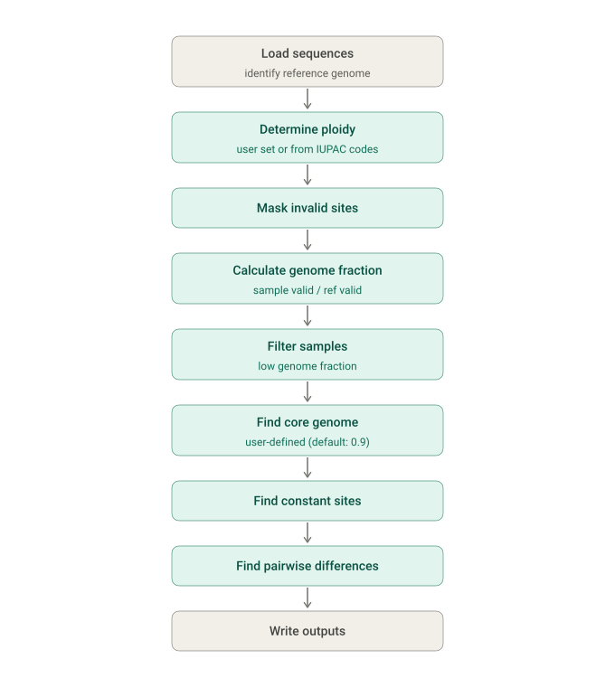

# PolyCore

PolyCore is a Python-based tool for **core genome analysis in polyploid organisms**.

## Features
Polycore can do the following for haploid, diploid, and triploid organisms:
* Determine the core genome (user defined - "soft" or "hard" core)
* Auto-filter low quality samples by the fraction of sites with missing data (`N`)
* Calculate pairwise nucleotide differences, taking into account ploidy
* Calculate constant sites for use with IQTREE
* Outputs core genome alignments (`FASTA` and `CSV`) and distance matrices (`CSV`)

## Overview



---

## Installation

#### Option 1 - Use the container (Preferred Method):

```bash
docker pull public.ecr.aws/o8h2f0o1/polycore:1.1.0
```

#### Option 2 - Clone the repository and install:

```bash
git clone https://github.com/WA-DOH/polycore.git
cd polycore
pip install -e .
```

---

## Usage

Run PolyCore from the command line:

```bash
polycore \
    --progressive \
    --ref reference.fasta \
    sample1.fasta sample2.fasta
```

### Options

```
PolyCore - Core genome analysis on polyploid organisms

positional arguments:
  input                 Input sequences

options:
  -h, --help            show this help message and exit
  --ref REF             Reference FASTA file
  --mask MASK           Bed file with coordinates of sites to exclude.
  --min-gf MIN_GF       Minimum genome fraction per input
  --min-cf MIN_CF       Minimum fraction with valid data per site
  --progressive
  --ploidy PLOIDY
  --chunk-size CHUNK_SIZE
                        Sites per chunk for pairwise diffs (controls memory)
  --split               Treat each contig in a multi-fasta file as a separate sample.
  --ref-by-name         Treat file/contig labeled 'reference' as the reference (case-insensitive).
  --snippy              Shortcut for Snippy *.full.aln input (sets split and ref-by-name).
  --version             show program's version number and exit
```

---

## Outputs

* `core.aln` : Core alignment (variants only, FASTA)
* `core.full.aln` : Full core alignment (FASTA)
* `full.csv` : Per-site summary for all passing samples
* `dist_wide.csv` : Pairwise distance matrix (wide)
* `dist_long.csv` : Pairwise distance matrix (long/tidy)
* `summary.csv` : Per-sample statistics
* `core_fraction_plot.html` : Interactive visualization of soft-core genome fraction

---

## Inputs
Polycore accepts a multiple sequence alignment as input. This can be supplied as **separate FASTA files** or as **single multi-FASTA**.

#### Separate FASTA files
Each FASTA file is treated as a separate sample. Files with multiple contigs are concatenated into a single sequence.
```
# Separate FASTA files
polycore *.fasta
```

#### A single multi-FASTA file
Each contig is treated as a separate sample.
```
# Single multi-FASTA
polycore --split alignment.fasta
```

### Reference Sequence
Polycore requires that a reference sequence is defined. This sequence is used to valid sites when calculating the genome fraction. The reference genome can be specified in the following manner:

- **Sequence order** - The first sequence in the alignment is treated as the reference
- **Sequence name** - The contig or FASTA file specified by `ref`

## Distance Calculation

PolyCore calculates pairwise distances by comparing allele representations at each valid site.

IUPAC ambiguity codes are represented as **equal fractional allele contributions** across the alleles they encode. For example:

* `A` represents 100% A
* `R` represents equal contributions from A and G
* `B` represents equal contributions from C, G, and T
* `N` represents an unknown base and is not used for comparison

The distance between two samples is the **total unmatched allele contribution** across comparable sites. Internally, fractional values are scaled by `COUNT_DENOM` to allow integer arithmetic before being converted back to the original distance scale.

### Example single-site distances

| Sample 1  | Sample 2    | Haploid (P=1) | Diploid (P=2) | Triploid (P=3) |
| --------- | ----------- | ------------: | ------------: | -------------: |
| A         | A           |             0 |             0 |              0 |
| A         | G           |             1 |             2 |              3 |
| A         | R (A/G)     |           0.5 |             1 |            1.5 |
| R (A/G)   | R (A/G)     |             0 |             0 |              0 |
| R (A/G)   | W (A/T)     |           0.5 |             1 |            1.5 |
| R (A/G)   | B (C/G/T)   |             — |             3 |              2 |
| B (C/G/T) | B (C/G/T)   |             — |             0 |              0 |
| B (C/G/T) | D (A/G/T)   |             — |             1 |              1 |
| A         | N (unknown) |             — |             — |              — |

`—` indicates that the comparison is not applicable because the ambiguity representation cannot be evenly scaled to the specified ploidy under the fixed-composition model.

### Interpretation

For example, at ploidy 3:

```text
A = 3 A
R = 1.5 A + 1.5 G
```

The shared allele contribution is `1.5 A`, resulting in a distance of:

```text
3 - 1.5 = 1.5
```

Thus, an `A` versus `R (A/G)` comparison contributes `1.5` to the distance at a triploid site.

The total pairwise distance is the sum of these per-site distances across all comparable sites.
